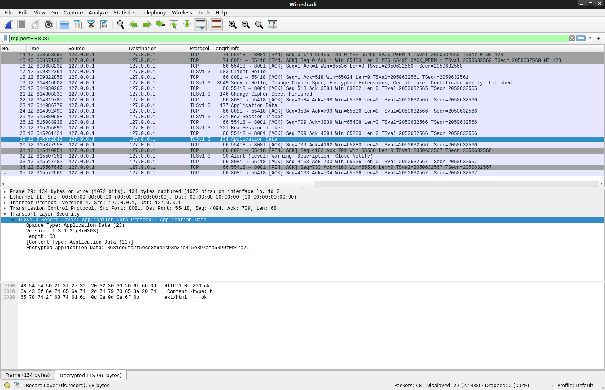

### OpenSSL docker with TLS trace enabled (`enable-ssl-trace`) and FIPS


Simple docker container with openssl `1.1.1i` which has TLS trace and FIPS enabled.

You can use this to view the low-level TLS traffic between a client and server and use openssl in fips compatible mode too

>> NOTE: to stop the containers, run `docker rm -f client server`

### FIPS or NO FIPS

- openssl `1.1.1i`


```bash
$ docker run  docker.io/salrashid123/openssl version
OpenSSL 1.1.1i  8 Dec 2020

$ docker run -e "OPENSSL_FIPS=0" docker.io/salrashid123/openssl version
FIPS mode not supported.
```

- openssl `1.0.1f`

The FIPS version uses `openssl-1.0.1f` and `openssl-fips-2.0.16` (you can use this to try out the old stuff)

```bash
$ docker run  docker.io/salrashid123/openssl:fips version
OpenSSL 1.0.1f-fips 6 Jan 2014

$ docker run -e "OPENSSL_FIPS=0" docker.io/salrashid123/openssl:fips version
OpenSSL 1.0.1f-fips 6 Jan 2014
```

#### With server TLS

```bash
# server
docker run \
  --name server \
  -p 8081:8081 \
  --net=host \
  -v `pwd`/html:/apps/ \
  -v `pwd`/certs:/certs \
  -t docker.io/salrashid123/openssl s_server   \
      -cert /certs/http_server.crt \
      -key /certs/http_server.key \
      -port 8081 \
      -CAfile /certs/tls-ca-chain.pem \
      -tlsextdebug \
      -tls1_3  \
      -trace \
      -WWW

# client
docker run \
  --name client \
  --net=host \
  -v `pwd`/certs/:/certs \
  -t docker.io/salrashid123/openssl s_client \
       -connect localhost:8081 \
       -servername http.domain.com \
       -CAfile /certs/tls-ca-chain.pem \
       -tls1_3 \
       -tlsextdebug \
       -trace

# curl
curl -vvvvv \
  -H "host: http.domain.com" \
  --resolve  http.domain.com:8081:127.0.0.1  \
  --cacert certs/tls-ca-chain.pem \
  https://http.domain.com:8081/index.html
```


#### With mTLS

```bash
#server
docker run \
  --name server \
  -p 8081:8081 \
  --net=host \
  -v `pwd`/html:/apps/ \
  -v `pwd`/certs:/certs \
  -t docker.io/salrashid123/openssl s_server \
       -cert /certs/http_server.crt \
       -key /certs/http_server.key \
       -port 8081 \
       -CAfile /certs/tls-ca-chain.pem \
       -Verify 5 \
       -tlsextdebug \
       -tls1_3  \
       -trace  \
       -WWW

# client
docker run  \
  --name client \
  --net=host \
  -v `pwd`/certs/:/certs \
  -t docker.io/salrashid123/openssl s_client \
       -connect localhost:8081 \
       -servername http.domain.com \
       -CAfile /certs/tls-ca-chain.pem \
       -cert /certs/client.crt \
       -key /certs/client.key \
       -tls1_3 \
       -tlsextdebug \
       --verify 5 \
       -trace

# curl
curl -vvvvv \
  -H "host: http.domain.com" \
  --resolve  http.domain.com:8081:127.0.0.1 \
  --cert certs/client.crt \
  --key certs/client.key \
  --cacert certs/tls-ca-chain.pem \
  https://http.domain.com:8081/index.html
```


#### With OCSP Stapling:

```bash
# server
docker run \
  --name server \
  -p 8081:8081 \
  --net=host -v `pwd`/html:/apps/ \
  -v `pwd`/certs:/certs \
  -t docker.io/salrashid123/openssl s_server \
       -status_file /certs/http_server_ocsp_resp_valid.bin \
       -cert /certs/http_server.crt \
       -key /certs/http_server.key \
       -port 8081 \
       -CAfile /certs/tls-ca-chain.pem \
       -Verify 5 \
       -tlsextdebug \
       -tls1_3 \
       -status \
       -status_verbose \
       -trace \
       -extended_crl \
       -WWW

# client
docker run \
 --name client \
 --net=host \
 -v `pwd`/certs/:/certs \
 -t docker.io/salrashid123/openssl s_client \
      -connect localhost:8081 \
      -servername http.domain.com \
      -CAfile /certs/tls-ca-chain.pem \
      -cert /certs/client.crt \
      -key /certs/client.key \
      -tls1_3 \
      -tlsextdebug \
      -status \
      --verify 5 \
      -trace

# curl
curl -vvvvv \
  -H "host: http.domain.com" \
  --resolve  http.domain.com:8081:127.0.0.1 \
  --cert certs/client.crt \
  --key certs/client.key \
  --cacert certs/tls-ca-chain.pem \
  --cert-status \
  https://http.domain.com:8081/index.html

```


Note, `http_server_ocsp_resp_valid.bin` is a valid OCSP response while `http_server_ocsp_resp_revoked.bin` is an expired one.


To see the details of an OCSP response, run
```bash
docker run \
 -v `pwd`/certs:/certs \
 docker.io/salrashid123/openssl ocsp \
   -CA /certs/tls-ca-ocsp-chain.pem \
   -CAfile /certs/tls-ca-ocsp-chain.pem \
   -respin /certs/http_server_ocsp_resp_valid.bin \
   -text
```


if you want to generate and use your own CA, see [Create Root CA Key and cert](https://github.com/salrashid123/ca_scratchpad)


#### TLS Decryption with wireshark

If you want to decrypt the actual TLS traffic using [wireshark](https://www.wireshark.org/), set an env-var for curl/openssl pointing to the keys `SSLKEYLOGFILE` 

Start Wireshark, under `Preferences->Protocols->TLS` set "(Pre)-Master-Secret log filename" to `/tmp/keylog.log`

Begin capture on `lo` (localhost) interface and filter on `tcp.port==8081`


Then run 

```bash
# server
docker run \
  --name server \
  -p 8081:8081 \
  --net=host \
  -v `pwd`/html:/apps/ \
  -v `pwd`/certs:/certs \
  -t docker.io/salrashid123/openssl s_server   \
      -cert /certs/http_server.crt \
      -key /certs/http_server.key \
      -port 8081 \
      -CAfile /certs/tls-ca-chain.pem \
      -tlsextdebug \
      -tls1_3  \
      -trace \
      -WWW

# curl
export SSLKEYLOGFILE=/tmp/keylog.log
curl -vvvvv \
  -H "host: http.domain.com" \
  --resolve  http.domain.com:8081:127.0.0.1 \
  --cert certs/client.crt \
  --key certs/client.key \
  --cacert certs/tls-ca-chain.pem \
  https://http.domain.com:8081/index.html
```

You should see the decrypted traffic (in this case the HTTPS response from the server, `ok`)



I've left a sample keylog file and associated tls capture (just load `tls.pcapng` in wireshark and then specify the path to `keylog.log` as the master-secret log file)


### FIPS Ciphers

- [https://wiki.openssl.org/index.php/FIPS_mode_and_TLS](https://wiki.openssl.org/index.php/FIPS_mode_and_TLS)

```basg
$ docker run  -e "OPENSSL_FIPS=1" -t docker.io/salrashid123/openssl:fips ciphers -v 'kRSA+FIPS:!TLSv1.2'
AES256-SHA              SSLv3 Kx=RSA      Au=RSA  Enc=AES(256)  Mac=SHA1
DES-CBC3-SHA            SSLv3 Kx=RSA      Au=RSA  Enc=3DES(168) Mac=SHA1
AES128-SHA              SSLv3 Kx=RSA      Au=RSA  Enc=AES(128)  Mac=SHA1

$ docker run  -e "OPENSSL_FIPS=1" -t docker.io/salrashid123/openssl:fips ciphers -v 'kRSA+FIPS'
AES256-GCM-SHA384       TLSv1.2 Kx=RSA      Au=RSA  Enc=AESGCM(256) Mac=AEAD
AES256-SHA256           TLSv1.2 Kx=RSA      Au=RSA  Enc=AES(256)  Mac=SHA256
AES256-SHA              SSLv3 Kx=RSA      Au=RSA  Enc=AES(256)  Mac=SHA1
DES-CBC3-SHA            SSLv3 Kx=RSA      Au=RSA  Enc=3DES(168) Mac=SHA1
AES128-GCM-SHA256       TLSv1.2 Kx=RSA      Au=RSA  Enc=AESGCM(128) Mac=AEAD
AES128-SHA256           TLSv1.2 Kx=RSA      Au=RSA  Enc=AES(128)  Mac=SHA256
AES128-SHA              SSLv3 Kx=RSA      Au=RSA  Enc=AES(128)  Mac=SHA1


$ docker run  -e "OPENSSL_FIPS=1" -t docker.io/salrashid123/openssl:fips ciphers -v 'TLSv1.2+FIPS:kRSA+FIPS:!eNULL:!aNULL'
ECDHE-RSA-AES256-GCM-SHA384 TLSv1.2 Kx=ECDH     Au=RSA  Enc=AESGCM(256) Mac=AEAD
ECDHE-ECDSA-AES256-GCM-SHA384 TLSv1.2 Kx=ECDH     Au=ECDSA Enc=AESGCM(256) Mac=AEAD
ECDHE-RSA-AES256-SHA384 TLSv1.2 Kx=ECDH     Au=RSA  Enc=AES(256)  Mac=SHA384
ECDHE-ECDSA-AES256-SHA384 TLSv1.2 Kx=ECDH     Au=ECDSA Enc=AES(256)  Mac=SHA384
DHE-DSS-AES256-GCM-SHA384 TLSv1.2 Kx=DH       Au=DSS  Enc=AESGCM(256) Mac=AEAD
DHE-RSA-AES256-GCM-SHA384 TLSv1.2 Kx=DH       Au=RSA  Enc=AESGCM(256) Mac=AEAD
DHE-RSA-AES256-SHA256   TLSv1.2 Kx=DH       Au=RSA  Enc=AES(256)  Mac=SHA256
DHE-DSS-AES256-SHA256   TLSv1.2 Kx=DH       Au=DSS  Enc=AES(256)  Mac=SHA256
ECDH-RSA-AES256-GCM-SHA384 TLSv1.2 Kx=ECDH/RSA Au=ECDH Enc=AESGCM(256) Mac=AEAD
ECDH-ECDSA-AES256-GCM-SHA384 TLSv1.2 Kx=ECDH/ECDSA Au=ECDH Enc=AESGCM(256) Mac=AEAD
ECDH-RSA-AES256-SHA384  TLSv1.2 Kx=ECDH/RSA Au=ECDH Enc=AES(256)  Mac=SHA384
ECDH-ECDSA-AES256-SHA384 TLSv1.2 Kx=ECDH/ECDSA Au=ECDH Enc=AES(256)  Mac=SHA384
AES256-GCM-SHA384       TLSv1.2 Kx=RSA      Au=RSA  Enc=AESGCM(256) Mac=AEAD
AES256-SHA256           TLSv1.2 Kx=RSA      Au=RSA  Enc=AES(256)  Mac=SHA256
ECDHE-RSA-AES128-GCM-SHA256 TLSv1.2 Kx=ECDH     Au=RSA  Enc=AESGCM(128) Mac=AEAD
ECDHE-ECDSA-AES128-GCM-SHA256 TLSv1.2 Kx=ECDH     Au=ECDSA Enc=AESGCM(128) Mac=AEAD
ECDHE-RSA-AES128-SHA256 TLSv1.2 Kx=ECDH     Au=RSA  Enc=AES(128)  Mac=SHA256
ECDHE-ECDSA-AES128-SHA256 TLSv1.2 Kx=ECDH     Au=ECDSA Enc=AES(128)  Mac=SHA256
DHE-DSS-AES128-GCM-SHA256 TLSv1.2 Kx=DH       Au=DSS  Enc=AESGCM(128) Mac=AEAD
DHE-RSA-AES128-GCM-SHA256 TLSv1.2 Kx=DH       Au=RSA  Enc=AESGCM(128) Mac=AEAD
DHE-RSA-AES128-SHA256   TLSv1.2 Kx=DH       Au=RSA  Enc=AES(128)  Mac=SHA256
DHE-DSS-AES128-SHA256   TLSv1.2 Kx=DH       Au=DSS  Enc=AES(128)  Mac=SHA256
ECDH-RSA-AES128-GCM-SHA256 TLSv1.2 Kx=ECDH/RSA Au=ECDH Enc=AESGCM(128) Mac=AEAD
ECDH-ECDSA-AES128-GCM-SHA256 TLSv1.2 Kx=ECDH/ECDSA Au=ECDH Enc=AESGCM(128) Mac=AEAD
ECDH-RSA-AES128-SHA256  TLSv1.2 Kx=ECDH/RSA Au=ECDH Enc=AES(128)  Mac=SHA256
ECDH-ECDSA-AES128-SHA256 TLSv1.2 Kx=ECDH/ECDSA Au=ECDH Enc=AES(128)  Mac=SHA256
AES128-GCM-SHA256       TLSv1.2 Kx=RSA      Au=RSA  Enc=AESGCM(128) Mac=AEAD
AES128-SHA256           TLSv1.2 Kx=RSA      Au=RSA  Enc=AES(128)  Mac=SHA256
AES256-SHA              SSLv3 Kx=RSA      Au=RSA  Enc=AES(256)  Mac=SHA1
DES-CBC3-SHA            SSLv3 Kx=RSA      Au=RSA  Enc=3DES(168) Mac=SHA1
AES128-SHA              SSLv3 Kx=RSA      Au=RSA  Enc=AES(128)  Mac=SHA1
```

```bash
docker run \
  --name server \
  -p 8081:8081 \
  --net=host \
  -e "OPENSSL_FIPS=1" \
  -v `pwd`/html:/apps/ \
  -v `pwd`/certs:/certs \
  -t docker.io/salrashid123/openssl:fips s_server   \
      -cert /certs/http_server.crt \
      -key /certs/http_server.key \
      -port 8081 \
      -cipher 'TLSv1.2+FIPS:kRSA+FIPS:!eNULL:!aNULL' \
      -CAfile /certs/tls-ca-chain.pem \
      -tlsextdebug \
      -WWW


docker run \
  --name client \
  --net=host \
  -e "OPENSSL_FIPS=1" \
  -v `pwd`/certs/:/certs \
  -t docker.io/salrashid123/openssl:fips s_client \
       -connect localhost:8081 \
       -cipher 'TLSv1.2+FIPS:kRSA+FIPS:!eNULL:!aNULL' \
       -servername http.domain.com \
       -CAfile /certs/tls-ca-chain.pem \
       -tlsextdebug
```
